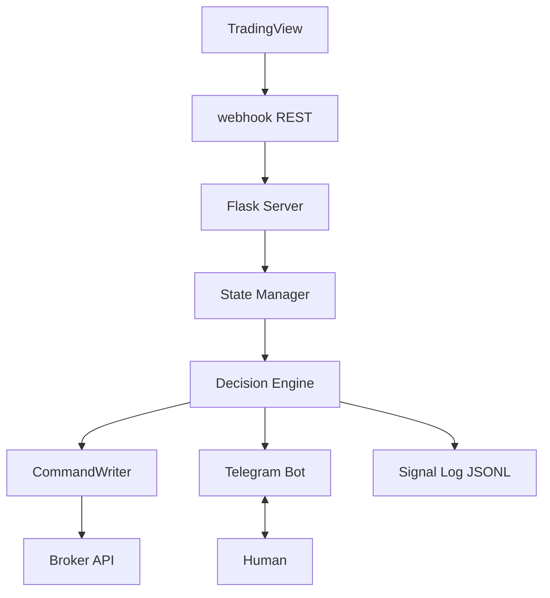
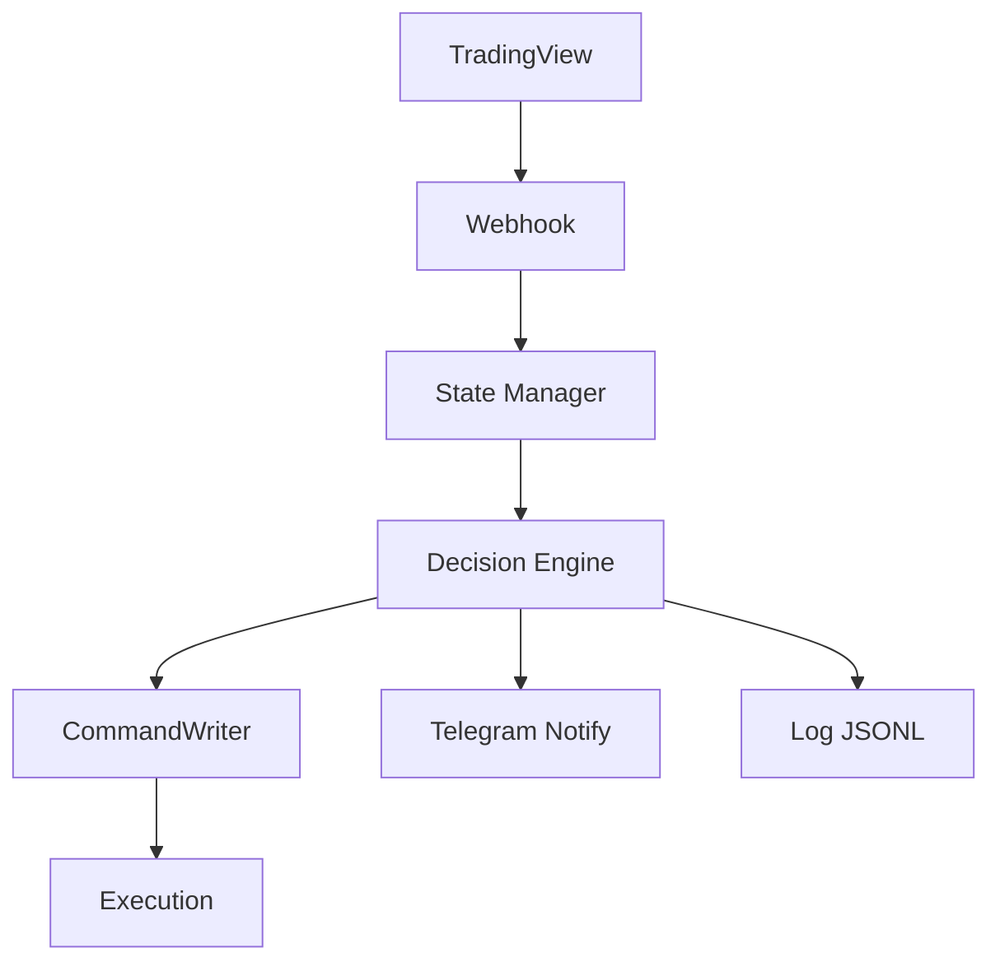
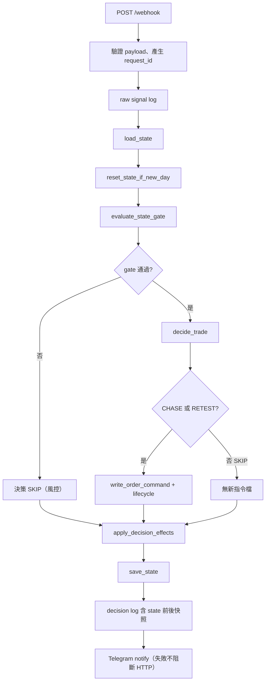
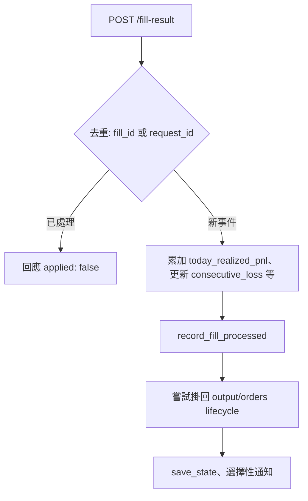
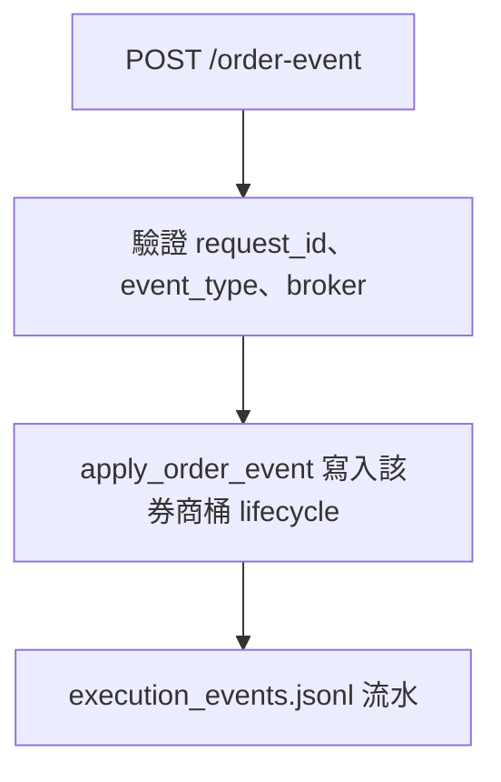
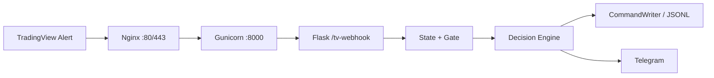

# yui-quant-lab

Breakout 訊號與 GEX 脈絡下的輕量決策實驗室：接收外部 alert、輸出結構化指令與日誌，方便接上實盤或通知層。

### 本版重點（摘要）

- **狀態與風控**：`state_manager` 載入／儲存、`reset_state_if_new_day`、`evaluate_state_gate`；決策日誌含 `state_snapshot_before` / `after`。
- **HTTP**：`/webhook` 走完整管線；`/fill-result` 回填損益與連虧計數；`/order-event` 更新檔案型訂單 lifecycle（`execution_tracker`）。
- **決策 trace**：`decision_engine` 新增 gate/threshold/summary 診斷欄位（如 `gates`、`thresholds`、`compact_summary`），並統一浮點顯示格式，方便除錯與回放比對。
- **輸入健壯性**：`signal` 先做正規化（去空白、轉小寫）再進入規則判斷，減少來源格式差異造成的誤判。
- **通知**：Telegram 僅針對決策結果，可環境變數切換真送或 stdout，失敗不阻斷 webhook。
- **驗證**：`tests/` 涵蓋 webhook、邊界、`replay`／e2e；`fixtures/` 供 `replay.py` 批次重播。

## 系統架構（總覽）



**現況**：`/webhook` 已打通 `state -> decision -> command -> log -> notify` 主流程，並在決策日誌內保留 `state_snapshot_before / state_snapshot_after` 便於追溯。

## 資料流（Data Flow）



## 專案結構

```
yui-quant-lab/
├── README.md
├── deploy/
│   ├── yui-quant-lab.service   # systemd 範本（Gunicorn，workers=1）
│   └── nginx-yui-quant-lab.conf
├── docs/
│   ├── architecture.md   # 系統架構與資料流
│   ├── decision_architecture_preview.md  # 決策流程預覽圖與核心規則摘要
│   ├── modules.md        # 各模組職責與介面
│   ├── roadmap.md        # 開發進度與下一步
│   └── vps_acceptance_runbook.md # VPS 完整驗收流程與異常定位
├── decision_engine.py    # CHASE / RETEST / SKIP 決策
├── state_manager.py      # 狀態載入/保存、跨日 reset、風控 gate
├── execution_tracker.py  # 訂單 lifecycle（檔案型）與 execution 事件 JSONL
├── time_utils.py         # 台北時區時間 helper（ISO8601）
├── command_writer.py     # 寫入 order_command.json、signal_log.jsonl
├── app.py                # Flask：健康檢查與 TradingView webhook
├── telegram_bot.py       # Telegram 決策通知（MVP stub + fallback print）
├── e2e_full_flow.py      # 端到端流程（測試與 demo 共用）
├── replay.py             # 以 fixtures 重播並驗證決策摘要
├── fixtures/             # replay 用 JSON 情境
├── scripts/
│   ├── run_e2e_demo.py              # 專案根執行：python scripts/run_e2e_demo.py
│   └── run_telegram_decision_smoke.py
├── tests/                  # unittest；見下方「測試」
└── output/                 # 執行期產物；其中 orders / state 等見 .gitignore
```

## 快速開始

本機啟動 HTTP 服務（預設 `0.0.0.0:5000`；可用環境變數 `FLASK_DEV_PORT` 覆寫。**正式 VPS** 請用 Nginx + Gunicorn + systemd，見 [docs/vps_runbook.md](docs/vps_runbook.md)）：

```bash
python app.py
```

- `GET /health`：健康檢查  
- `POST /webhook`：接收 JSON alert；步驟與分支見下方 **Mermaid 流程圖**（與 Phase 3 的 `/tv-webhook` 為同一套決策管線時可對照）。
- `POST /fill-result`：必填 `pnl`，且至少提供 `request_id` / `broker_order_id` / `client_order_id` 其中之一；更新 `today_realized_pnl`（並同步舊欄位 `today_loss`）、`consecutive_loss`、`cooldown_until`、`regime`。建議同送 `broker` + `broker_order_id` 以便掛回正確券商桶。可選 `fill_id`、`filled_qty`、`avg_fill_price`；去重優先 `fill_id`，否則 `request_id`（重複則 `applied: false`）。會嘗試把 fill 掛回 `output/orders/<request_id>.json` lifecycle（找不到則記 `fill_unlinked`）。流程見下方圖。
- `POST /order-event`：必填 `request_id` + `event_type` + `broker`，更新該券商桶下 lifecycle（例如 `order_acknowledged` / `order_rejected`）。流程見下方圖。

#### `POST /webhook` 管線（Mermaid）



#### `POST /fill-result` 管線（Mermaid）



#### `POST /order-event` 管線（Mermaid）



`request_id` 格式：`YYYYMMDDTHHMMSS_xxxxxx`（例如 `20260419T103012_ab12cd`）。
時間欄位統一採台北時區 ISO8601（`+08:00`）。

### Telegram 決策通知（可選）

本專案目前**僅對決策結果**提供可讀性較佳的 Telegram 文字通知（不依賴 Markdown/HTML）。環境變數範例見 [.env.example](.env.example)。

| 變數 | 說明 |
|------|------|
| `ENABLE_TELEGRAM_NOTIFY` | 未設定或空字串：只印 stdout（`mode=print`）。`true`：呼叫 Telegram API。其他非空值（例如 `false`）：只印 stdout（`mode=disabled`）。 |
| `TELEGRAM_BOT_TOKEN` | BotFather 核發的 token；僅在 `ENABLE_TELEGRAM_NOTIFY=true` 且要真發送時需要。 |
| `TELEGRAM_CHAT_ID` | 目標 chat id；同上。 |

`notify_decision` 回傳的 `mode` 為 `telegram` / `print` / `disabled` / `missing_credentials`；API 失敗時仍為 `telegram` 且 `ok=false`，**不會讓 webhook 主流程或 HTTP 失敗**。

本機 smoke（不需 TradingView）：

```bash
# 關閉 API、僅 stdout（預期 mode=disabled）
python scripts/run_telegram_decision_smoke.py print-fallback

# 真發送（需已匯出 TELEGRAM_BOT_TOKEN、TELEGRAM_CHAT_ID）
set ENABLE_TELEGRAM_NOTIFY=true
python scripts/run_telegram_decision_smoke.py telegram
```

PowerShell 可改用：`$env:ENABLE_TELEGRAM_NOTIFY="true"`（並確認已設定 `TELEGRAM_BOT_TOKEN`、`TELEGRAM_CHAT_ID`）。

也可一次性產生專案 `.env`（下次重開終端不需重設）：

```powershell
powershell -ExecutionPolicy Bypass -File scripts/setup_env.ps1
```

一鍵重跑「TradingView -> Flask -> Telegram」本機鏈路驗證：

```bash
python scripts/run_live_chain_check.py
```

### State 欄位語意（本版）

- `today_realized_pnl`：**當日已實現損益累加值**（有號數；獲利為正、虧損為負），由 `/fill-result` 的 `pnl` 累加而來。  
- `today_loss`：**舊欄位名稱，語意上等同 `today_realized_pnl`**（為了相容既有程式與通知格式，會與 `today_realized_pnl` 保持相同數值）。  
- `consecutive_loss`：**連續「虧損筆數」**；`pnl < 0` 時 +1，`pnl > 0` 時歸零，`pnl == 0` 時**維持不變**。  

去重儲存：`output/fill_request_ids.json`（`processed_keys`：`req:` / `fill:` 前綴）。  
Lifecycle 儲存：`output/orders/<request_id>.json`；事件流水：`output/execution_events.jsonl`。

上述路徑與本機 `state.json` 等執行期產物，預設由 `.gitignore`（`output/*` + `!output/.gitkeep`）排除，避免把實驗流水推上遠端。若你的 repo 曾經追蹤過 `output/*.json`，請在本機確認是否要用 `git rm --cached` 停止追蹤（避免之後誤提交）。

## State Gate & Cooldown Design

### 1. 概念總覽

本系統將「策略決策」與「執行風控」分層處理：

- `decision_engine`：負責市場條件判斷（例如 `CHASE` / `RETEST` / `SKIP`）。
- `state gate`：負責執行層風控，決定最終是否允許下單。

即使 `decision_engine` 判斷可交易，仍可能被 `state gate` 拒單。

### 2. Hard Locks vs Soft Flags

本節定義目標狀態模型：以 Hard Locks / Soft Flags 分離執行風控語意。

> 實作現況（MVP）：目前 state schema 仍保留 `lock_reason` 相容欄位，state gate 拒單條件已落地 `cooldown_active`；其餘 Hard Locks 與 Soft Flags 為規格保留項，後續版本逐步實作。

#### Hard Locks（會拒單）

代表強制風控條件；任一條件成立即拒單：

- `cooldown_active`
- `manual_lock`
- `daily_max_loss`
- `loss_streak_lock`
- `account_locked`
- `prop_rule_violation`

#### Soft Flags（不拒單）

僅供提示與分析，不直接影響下單：

- `high_vol`
- `news_event`
- `low_liquidity`
- `warning_only`

`state gate` 僅依據 Hard Locks 判斷是否拒單。

### 3. Cooldown 設計

`cooldown_active` 為時間型 Hard Lock，用於短時間暫停交易。

設計原則摘要：

- 避免使用單純 boolean（降低長期鎖定風險）。
- 採用時間驅動，明確定義解除時點。

```python
cooldown_until = now + timedelta(minutes=N)
```

### Enforcement Rules

- `decision_engine` 不得直接依賴或修改 state gate 的 Hard Locks / Soft Flags。
- `state gate` 不得重寫或覆蓋 `decision_engine` 的策略判斷邏輯。
- Hard Locks 必須明確列舉，不得使用模糊條件（例如：非空即判斷）。
- Soft Flags 不得影響最終是否下單。
- cooldown 必須以時間（`cooldown_until`）為唯一判斷來源，不得使用長期 boolean 狀態。

### Invariants

以下條件在任何情況下必須成立：

- 存在 Hard Lock 時，最終決策必須為拒單（`SKIP` / `STATE_GATE`）。
- 不存在 Hard Lock 時，state gate 不得拒單。
- `cooldown_active` 僅由 `now < cooldown_until` 推導，不可手動長期設為 `true`。
- duplicate request 的處理不得影響 state gate 判斷結果。

### Change Policy

- 所有涉及 state gate 行為的修改，必須同步更新本文件。
- 若程式碼與本文件語義不一致，以本文件為準。

本節為 state gate 行為的標準語義定義；任何設計變更皆需同步檢視並更新本節內容。

## Phase 3: End-to-End Verified

**目標**：TradingView → VPS（**Nginx:80 → Gunicorn:8000 →** Flask `/tv-webhook`）→ decision engine → `output/signal_log.jsonl` → Telegram，單筆 alert 可重現驗收。

#### Phase 3 部署路徑（Mermaid）



- **Webhook URL（HTTP、port 80）**：`http://<VPS公網IP>/tv-webhook`（TradingView 僅允許 80/443；由 **Nginx** 對外聽 **80** 再轉發至本機 Gunicorn。）
- **TradingView Alert message（最小 JSON 範例）**：

```json
{
  "secret": "your_secret_here",
  "symbol": "MNQ",
  "signal": "long_breakout",
  "price": 20150,
  "breakout_level": 20145,
  "delta_strength": 0.88
}
```

`secret` 必須與伺服器 `.env` 的 `TV_WEBHOOK_SECRET` **完全一致**（逐字比對）。

- **如何快速判斷成功**：
  1. `tail` 看 `output/signal_log.jsonl`：同一 `request_id` 可追到 `tv_webhook_received` → `decision_result` →（若有下單意圖）`command_write` 等事件鏈。
  2. Telegram 收到對應決策通知（與 `ENABLE_TELEGRAM_NOTIFY=true` 設定一致）。

更完整的欄位說明、排錯與單筆真 alert 驗收清單見 [docs/phase3_tradingview_e2e.md](docs/phase3_tradingview_e2e.md)；VPS 啟動與 `curl` 驗收指令見 [docs/vps_runbook.md](docs/vps_runbook.md)。

## VPS 例行驗收（精簡版）

完整驗收表與異常快速定位請看 [docs/vps_acceptance_runbook.md](docs/vps_acceptance_runbook.md)。

### 最小 4 步（部署後必跑）

1) 服務與 Port

```bash
sudo systemctl is-active yui-quant-lab.service
sudo systemctl is-active nginx
ss -ltnp | grep -E ':8000|:80'
```

2) 健康檢查（內網 + 公網）

```bash
curl -i http://127.0.0.1/health
curl -i http://127.0.0.1:8000/health
curl -i http://<VPS_PUBLIC_IP>/health
```

3) `/tv-webhook` 基本驗收

```bash
cd ~/yui-quant-lab
source .venv/bin/activate
TVS=$(python -c "from dotenv import dotenv_values; print(dotenv_values('.env').get('TV_WEBHOOK_SECRET',''))")
curl -i -X POST http://127.0.0.1/tv-webhook \
  -H "Content-Type: application/json" \
  -d "{\"secret\":\"$TVS\",\"symbol\":\"MNQ\",\"signal\":\"long_breakout\",\"price\":20150,\"breakout_level\":20145,\"delta_strength\":0.88}"
```

4) 決策落地檢查

```bash
cd ~/yui-quant-lab
tail -n 20 output/signal_log.jsonl
```

### Fixture 重播與 E2E

```bash
# 單一或目錄批次（詳見 replay.py 說明）
python replay.py fixtures/chase_clean.json
python replay.py fixtures/

# stdout 摘要（包一層 scripts）
python scripts/run_e2e_demo.py
```

決策引擎單機試跑：

```bash
python decision_engine.py
```

## 文件

詳細說明請見 [docs/architecture.md](docs/architecture.md)、[docs/decision_architecture_preview.md](docs/decision_architecture_preview.md)、[docs/modules.md](docs/modules.md)、[docs/roadmap.md](docs/roadmap.md)、[docs/strategy_spec_v1.md](docs/strategy_spec_v1.md)（策略欄位與行為規格草稿）；Phase 3 與 VPS 操作另見 [docs/phase3_tradingview_e2e.md](docs/phase3_tradingview_e2e.md)、[docs/vps_runbook.md](docs/vps_runbook.md)、[docs/vps_acceptance_runbook.md](docs/vps_acceptance_runbook.md)。

## 測試

```bash
python -m unittest discover -s tests -p "test_*.py" -v
```

## 免責

本專案為研究與工程實驗用途；任何交易決策與風險由使用者自行承擔。
