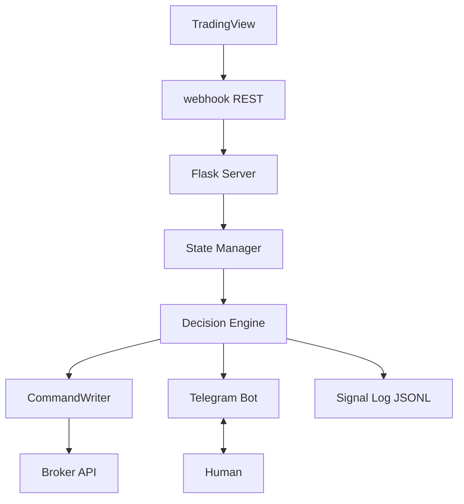
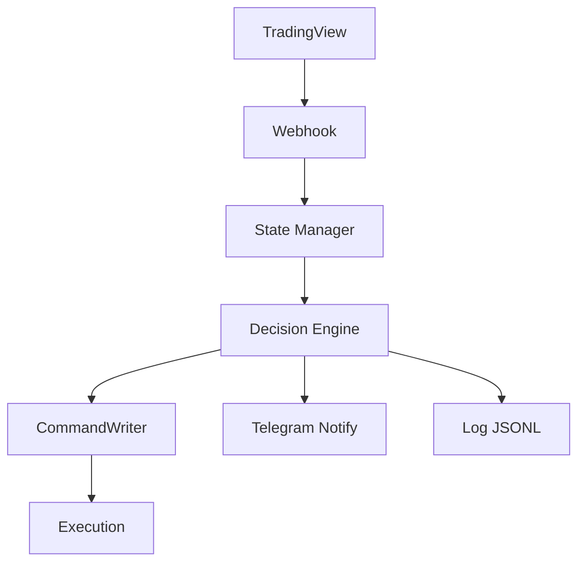

# yui-quant-lab

Breakout 訊號與 GEX 脈絡下的輕量決策實驗室：接收外部 alert、輸出結構化指令與日誌，方便接上實盤或通知層。

### 本版重點（摘要）

- **狀態與風控**：`state_manager` 載入／儲存、`reset_state_if_new_day`、`evaluate_state_gate`；決策日誌含 `state_snapshot_before` / `after`。
- **HTTP**：`/webhook` 走完整管線；`/fill-result` 回填損益與連虧計數；`/order-event` 更新檔案型訂單 lifecycle（`execution_tracker`）。
- **通知**：Telegram 僅針對決策結果，可環境變數切換真送或 stdout，失敗不阻斷 webhook。
- **驗證**：`tests/` 涵蓋 webhook、邊界、`replay`／e2e；`fixtures/` 供 `replay.py` 批次重播。

## 系統架構（總覽）



**現況**：`/webhook` 已打通 `state -> decision -> command -> log -> notify` 主流程，並在決策日誌內保留 `state_snapshot_before / state_snapshot_after` 便於追溯。

## 資料流（Data Flow）



## 專案結構

```
yui-quant-lab/
├── README.md
├── docs/
│   ├── architecture.md   # 系統架構與資料流
│   ├── modules.md        # 各模組職責與介面
│   └── roadmap.md        # 開發進度與下一步
├── decision_engine.py    # CHASE / RETEST / SKIP 決策
├── state_manager.py      # 狀態載入/保存、跨日 reset、風控 gate
├── execution_tracker.py  # 訂單 lifecycle（檔案型）與 execution 事件 JSONL
├── time_utils.py         # 台北時區時間 helper（ISO8601）
├── command_writer.py     # 寫入 order_command.json、signal_log.jsonl
├── app.py                # Flask：健康檢查與 TradingView webhook
├── telegram_bot.py       # Telegram 決策通知（MVP stub + fallback print）
├── e2e_full_flow.py      # 端到端流程（測試與 demo 共用）
├── replay.py             # 以 fixtures 重播並驗證決策摘要
├── fixtures/             # replay 用 JSON 情境
├── scripts/
│   ├── run_e2e_demo.py              # 專案根執行：python scripts/run_e2e_demo.py
│   └── run_telegram_decision_smoke.py
├── tests/                  # unittest；見下方「測試」
└── output/                 # 執行期產物；其中 orders / state 等見 .gitignore
```

## 快速開始

本機啟動 HTTP 服務（預設 `0.0.0.0:5000`）：

```bash
python app.py
```

- `GET /health`：健康檢查  
- `POST /webhook`：接收 JSON alert，處理順序如下：  
  1. 驗證 payload + 產生 `request_id`  
  2. raw signal log  
  3. `load_state` + `reset_state_if_new_day` + `evaluate_state_gate`  
  4. 決策（gate fail 則直接 `SKIP`）  
  5. `CHASE/RETEST` 產生 `order_command.json`（成功後建立 execution lifecycle；可選帶 `broker` 指定券商桶，預設 `single_broker`）  
  6. `apply_decision_effects` + `save_state`  
  7. decision log（含 before/after state）+ Telegram notify
- `POST /fill-result`：接收真實成交結果（必填 `pnl`；並至少提供 `request_id` / `broker_order_id` / `client_order_id` 其中之一），更新 `today_realized_pnl`（並同步舊欄位 `today_loss`）、`consecutive_loss`、`cooldown_until`、`regime`；建議同送 `broker` + `broker_order_id` 以便掛回正確券商桶。可選 `fill_id`、`filled_qty`、`avg_fill_price`。去重優先使用 `fill_id`，否則退回 `request_id`（`applied: false`）。並嘗試把 fill 掛回 `output/orders/<request_id>.json` lifecycle（找不到則記 `fill_unlinked`）。
- `POST /order-event`：執行端回報（必填 `request_id` + `event_type` + `broker`），更新該券商桶下的 lifecycle（例如 `order_acknowledged` / `order_rejected`）。

`request_id` 格式：`YYYYMMDDTHHMMSS_xxxxxx`（例如 `20260419T103012_ab12cd`）。
時間欄位統一採台北時區 ISO8601（`+08:00`）。

### Telegram 決策通知（可選）

本專案目前**僅對決策結果**提供可讀性較佳的 Telegram 文字通知（不依賴 Markdown/HTML）。環境變數範例見 [.env.example](.env.example)。

| 變數 | 說明 |
|------|------|
| `ENABLE_TELEGRAM_NOTIFY` | 未設定或空字串：只印 stdout（`mode=print`）。`true`：呼叫 Telegram API。其他非空值（例如 `false`）：只印 stdout（`mode=disabled`）。 |
| `TELEGRAM_BOT_TOKEN` | BotFather 核發的 token；僅在 `ENABLE_TELEGRAM_NOTIFY=true` 且要真發送時需要。 |
| `TELEGRAM_CHAT_ID` | 目標 chat id；同上。 |

`notify_decision` 回傳的 `mode` 為 `telegram` / `print` / `disabled` / `missing_credentials`；API 失敗時仍為 `telegram` 且 `ok=false`，**不會讓 webhook 主流程或 HTTP 失敗**。

本機 smoke（不需 TradingView）：

```bash
# 關閉 API、僅 stdout（預期 mode=disabled）
python scripts/run_telegram_decision_smoke.py print-fallback

# 真發送（需已匯出 TELEGRAM_BOT_TOKEN、TELEGRAM_CHAT_ID）
set ENABLE_TELEGRAM_NOTIFY=true
python scripts/run_telegram_decision_smoke.py telegram
```

PowerShell 可改用：`$env:ENABLE_TELEGRAM_NOTIFY="true"`（並確認已設定 `TELEGRAM_BOT_TOKEN`、`TELEGRAM_CHAT_ID`）。

### State 欄位語意（本版）

- `today_realized_pnl`：**當日已實現損益累加值**（有號數；獲利為正、虧損為負），由 `/fill-result` 的 `pnl` 累加而來。  
- `today_loss`：**舊欄位名稱，語意上等同 `today_realized_pnl`**（為了相容既有程式與通知格式，會與 `today_realized_pnl` 保持相同數值）。  
- `consecutive_loss`：**連續「虧損筆數」**；`pnl < 0` 時 +1，`pnl > 0` 時歸零，`pnl == 0` 時**維持不變**。  

去重儲存：`output/fill_request_ids.json`（`processed_keys`：`req:` / `fill:` 前綴）。  
Lifecycle 儲存：`output/orders/<request_id>.json`；事件流水：`output/execution_events.jsonl`。

上述路徑與本機 `state.json` 已由 `.gitignore` 排除，避免把實驗流水推上遠端；版庫內僅保留 `output/order_command.json`、`output/signal_log.jsonl` 作為**結構範例**（實際內容以你機器上跑出的為準）。

### Fixture 重播與 E2E

```bash
# 單一或目錄批次（詳見 replay.py 說明）
python replay.py fixtures/chase_clean.json
python replay.py fixtures/

# stdout 摘要（包一層 scripts）
python scripts/run_e2e_demo.py
```

決策引擎單機試跑：

```bash
python decision_engine.py
```

## 文件

詳細說明請見 [docs/architecture.md](docs/architecture.md)、[docs/modules.md](docs/modules.md)、[docs/roadmap.md](docs/roadmap.md)、[docs/strategy_spec_v1.md](docs/strategy_spec_v1.md)（策略欄位與行為規格草稿）。

## 測試

```bash
python -m unittest discover -s tests -p "test_*.py" -v
```

## 免責

本專案為研究與工程實驗用途；任何交易決策與風險由使用者自行承擔。
