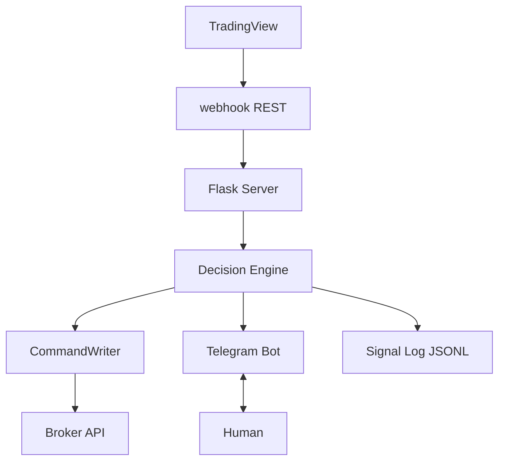
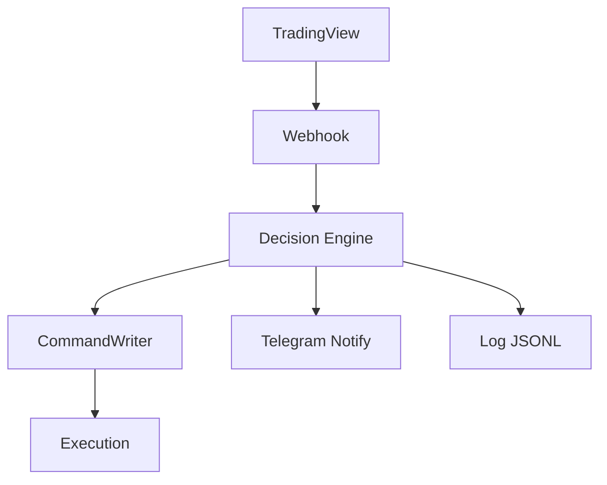

# yui-quant-lab

Breakout 訊號與 GEX 脈絡下的輕量決策實驗室：接收外部 alert、輸出結構化指令與日誌，方便接上實盤或通知層。

## 系統架構（總覽）



**現況**：`app.py` 的 `/webhook` 目前已驗證 JSON；完整串接決策引擎與 CommandWriter 仍為下一步（見 [docs/roadmap.md](docs/roadmap.md)）。

## 資料流（Data Flow）



## 專案結構

```
yui-quant-lab/
├── README.md
├── docs/
│   ├── architecture.md   # 系統架構與資料流
│   ├── modules.md        # 各模組職責與介面
│   └── roadmap.md        # 開發進度與下一步
├── decision_engine.py    # CHASE / RETEST / SKIP 決策
├── command_writer.py     # 寫入 order_command.json、signal_log.jsonl
├── app.py                # Flask：健康檢查與 TradingView webhook
├── telegram_bot.py       # Telegram 整合（預留）
└── output/               # 執行期產物（勿手動編輯為主）
```

## 快速開始

本機啟動 HTTP 服務（預設 `0.0.0.0:5000`）：

```bash
python app.py
```

- `GET /health`：健康檢查  
- `POST /webhook`：接收 JSON alert（欄位見 `app.py` 內 `REQUIRED_FIELDS`）

決策引擎單機試跑：

```bash
python decision_engine.py
```

## 文件

詳細說明請見 [docs/architecture.md](docs/architecture.md)、[docs/modules.md](docs/modules.md)、[docs/roadmap.md](docs/roadmap.md)。

## 免責

本專案為研究與工程實驗用途；任何交易決策與風險由使用者自行承擔。
