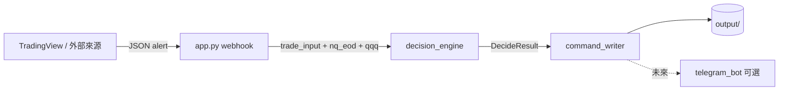

# 系統架構

## 目標

將「盤中突破類訊號」與「EOD GEX 價位／bias」結合，產出一致、可稽核的決策（CHASE／RETEST／SKIP），並以 JSON／JSONL 形式交給下游執行或監控。

## 邏輯分層

| 層級 | 職責 | 目前實作 |
|------|------|----------|
| 入口 | 接收外部事件、驗證 payload | `app.py`（Flask webhook） |
| 決策 | 規則引擎、閾值、plan 組裝 | `decision_engine.py` |
| 輸出 | 原子寫入指令檔、追加訊號日誌 | `command_writer.py` |
| 通知 | 推播或雙向指令（可選） | `telegram_bot.py`（預留） |

## 資料流（目標形態）

**現況**：`app.py` 的 `/webhook` 已驗證欄位並回傳成功，尚未串接 `decide_trade` 與 `write_order_command`；串接後上述流程即可閉環到 `output/`。

## 決策順序（摘要）

由強到弱（細節與閾值見 `decision_engine.py` 模組說明）：

1. `delta_strength` 低於閾值 → SKIP  
2. `signal` 非 `long_breakout` / `short_breakout` → SKIP  
3. 計算延伸量、最近壓力／支撐空間，分 long／short 分支  
4. 不符合 bias → SKIP；空間或延伸不理想 → RETEST；否則 CHASE  

`qqq_intraday.regime` 本版僅寫入 `plan.risk_note` 參考，不參與分支。

## 產物目錄 `output/`

| 檔案 | 用途 |
|------|------|
| `order_command.json` | 當前（最後一筆）指令；由 `command_writer` 原子覆寫 |
| `order_command.json.tmp` | 寫入暫存（生命週期極短） |
| `signal_log.jsonl` | 訊號／決策相關紀錄，一行一筆 JSON |

部署時請確保程式工作目錄能寫入 `output/`，或日後將路徑改為環境變數設定。
