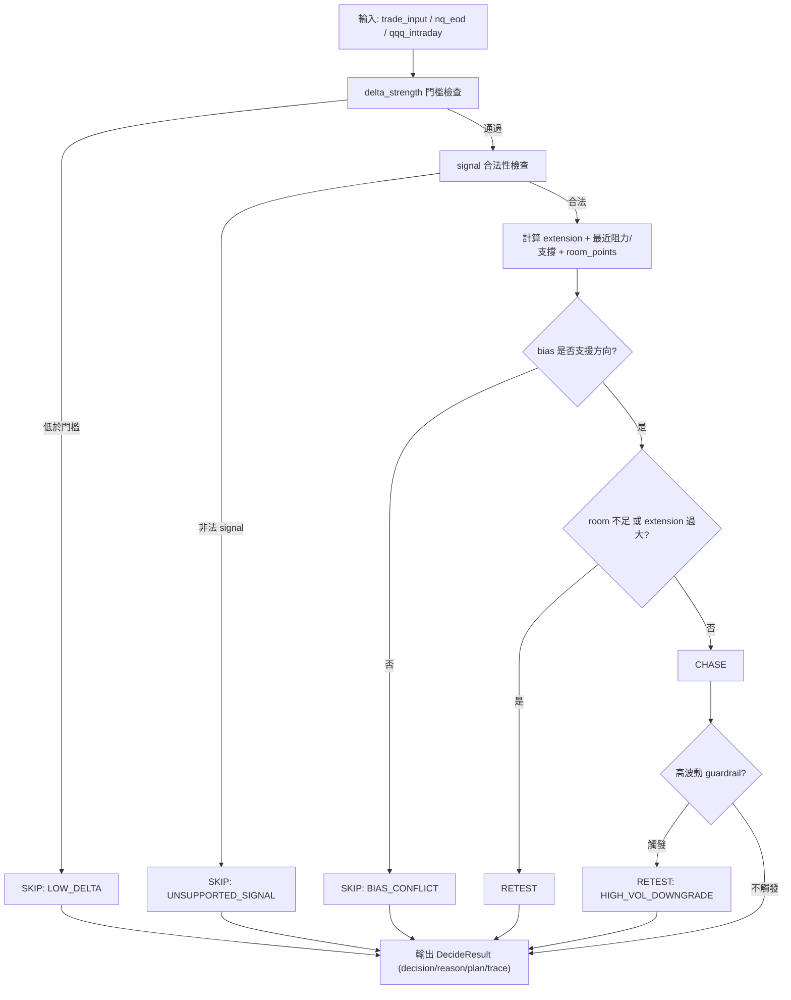

# 決策架構圖與核心程式

## 決策架構圖（Mermaid）



## 核心程式（現有專案）

### decide_trade 入口

```python
def decide_trade(
    trade_input: TradeInput,
    nq_eod: NqEod | None = None,
    qqq_intraday: QqqIntraday | None = None,
    state: dict[str, Any] | None = None,
) -> DecideResult:
    """
    依 breakout 訊號 + GEX（levels / bias）輸出 CHASE / RETEST / SKIP。
    """
```

### 關鍵規則（摘要）

```python
if delta_strength < MIN_DELTA_STRENGTH:
    return _finish_decide("SKIP", "...", ..., reason_code=REASON_LOW_DELTA, ...)

if signal_raw not in ("long_breakout", "short_breakout"):
    return _finish_decide("SKIP", "unsupported_signal", 0.0, reason_code=REASON_UNSUPPORTED_SIGNAL, ...)

if signal == "long_breakout":
    # bias / room / extension 檢查 -> SKIP / RETEST / CHASE
else:
    # short_breakout 對稱檢查

if regime_s == REGIME_HIGH_VOL and decision == "CHASE":
    # 高波動 guardrail，可能降級為 RETEST
```

## 原始檔案位置

- `decision_engine.py`
- `README.md`
- `docs/architecture.md`
